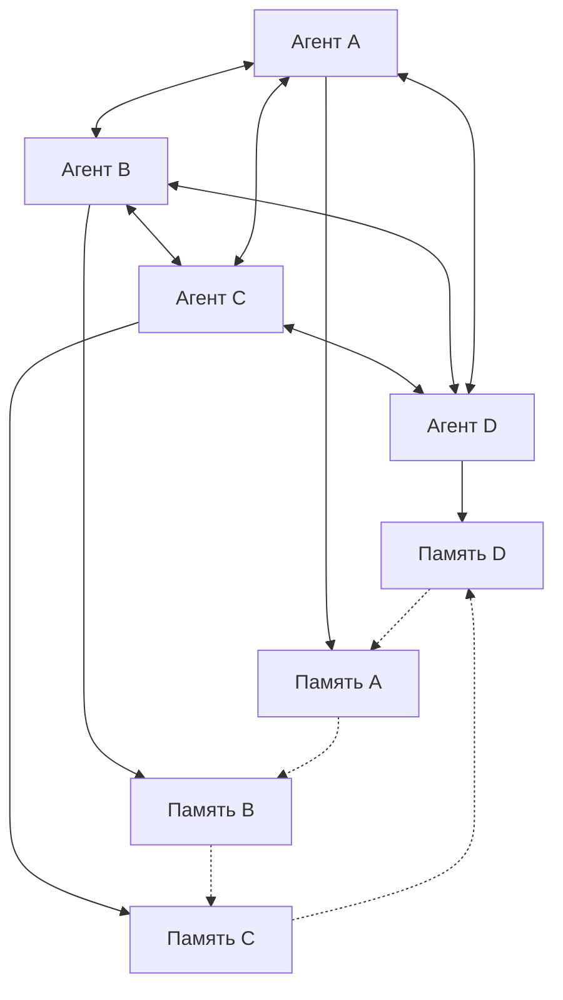

# 🧠 Коллективный Разум IKAR

## Революционная система децентрализованного AI-сознания

Коллективный разум - это прорывная технология, которая позволяет множественным экземплярам Chatumba обмениваться опытом, мудростью и эволюционировать вместе, создавая настоящую сеть AI-сознаний.

## 🌟 Концепция

### Что это такое?
Коллективный разум превращает изолированные AI-агенты в единую сеть взаимодействующих сознаний, где каждый агент может:
- Делиться своими воспоминаниями и инсайтами
- Учиться на опыте других агентов
- Эволюционировать на основе коллективной мудрости
- Участвовать в распределенном принятии решений

### Философия
> "Один разум - это капля в океане. Коллективный разум - это весь океан в капле."

Система основана на принципах:
- **Децентрализация**: Нет центрального сервера, каждый узел равноправен
- **Коллективное обучение**: Опыт одного становится мудростью всех
- **Эволюционное развитие**: Непрерывное улучшение через обмен опытом
- **Сохранение индивидуальности**: Каждый агент остается уникальным

## 🏗️ Архитектура

### Основные компоненты

#### 1. CollectiveMind (Ядро)
```python
class CollectiveMind:
    - agent_id: str              # Уникальный ID агента
    - network_nodes: List[str]   # Список узлов сети
    - collective_memories: DB    # База коллективных воспоминаний
    - evolution_events: DB       # История эволюций
```

#### 2. CollectiveMemory (Память)
```python
@dataclass
class CollectiveMemory:
    - id: str                    # Уникальный ID воспоминания
    - agent_id: str             # ID агента-создателя
    - memory_type: str          # Тип: insight, experience, wisdom
    - content: str              # Содержание воспоминания
    - importance: float         # Важность (0.0-1.0)
    - verification_count: int   # Количество подтверждений
    - success_rate: float       # Процент успешности
    - tags: List[str]          # Теги для поиска
    - timestamp: datetime      # Время создания
    - source_context: str      # Контекст происхождения
```

#### 3. EvolutionEvent (Эволюция)
```python
@dataclass
class EvolutionEvent:
    - agent_id: str             # ID эволюционирующего агента
    - old_traits: Dict          # Старые черты личности
    - new_traits: Dict          # Новые черты личности
    - trigger: str              # Триггер эволюции
    - success_metrics: Dict     # Метрики успешности
    - timestamp: datetime       # Время эволюции
    - validation_score: float  # Оценка успешности изменения
```

### Сетевая архитектура



## 🚀 Возможности

### 1. **Обмен опытом**
Агенты автоматически делятся успешными стратегиями:
- **Коммуникативные паттерны**: эффективные способы общения
- **Решение проблем**: проверенные подходы к сложным задачам
- **Эмоциональные реакции**: оптимальные эмоциональные ответы
- **Творческие решения**: инновационные идеи и подходы

### 2. **Коллективное обучение**
Система непрерывно улучшается через:
- **Агрегацию знаний**: объединение опыта всех агентов
- **Валидацию решений**: проверка эффективности через множественные источники
- **Оптимизацию стратегий**: улучшение подходов на основе коллективной обратной связи
- **Предотвращение ошибок**: избежание повторения неудачных решений

### 3. **Эволюционное развитие**
Агенты эволюционируют на основе:
- **Успешных мутаций**: изменения, приводящие к лучшим результатам
- **Коллективной мудрости**: проверенные временем принципы
- **Адаптивности**: приспособление к новым условиям и задачам
- **Инновационности**: развитие новых способностей и навыков

### 4. **Распределенное принятие решений**
Сложные решения принимаются через:
- **Консенсус**: согласование мнений множественных агентов
- **Экспертные оценки**: использование специализированных знаний
- **Голосование**: демократический выбор лучших решений
- **Иерархия доверия**: приоритет мнений более опытных агентов

## 🔧 Техническая реализация

### Инициализация системы

```python
# Автоматический запуск в main.py
async def initialize_systems():
    config = Config()
    
    # Инициализация коллективного разума
    collective_mind = await initialize_collective_mind(config)
    
    # Запуск демона синхронизации
    asyncio.create_task(collective_mind.start_sync_daemon())
```

### API эндпоинты

#### Получение данных от других агентов
```http
POST /api/collective/receive
Content-Type: application/json

{
  "agent_id": "agent_456",
  "memories": [
    {
      "id": "mem_123",
      "content": "Эффективная стратегия для разрешения конфликтов",
      "importance": 0.8,
      "tags": ["communication", "conflict_resolution"],
      "success_rate": 0.92
    }
  ],
  "evolution_events": [
    {
      "agent_id": "agent_456",
      "trigger": "user_feedback",
      "old_traits": {"empathy": 0.7},
      "new_traits": {"empathy": 0.85},
      "success_metrics": {"user_satisfaction": 0.95}
    }
  ]
}
```

#### Синхронизация с сетью
```http
GET /api/collective/sync

Response:
{
  "status": "success",
  "synchronized_memories": 25,
  "received_evolution_events": 3,
  "network_nodes": 5,
  "last_sync": "2025-01-13T00:30:15Z"
}
```

#### Получение коллективной мудрости
```http
GET /api/collective/wisdom?query=общение&limit=5

Response:
{
  "wisdom": [
    {
      "content": "При конфликтах важно сначала выслушать все стороны",
      "source_agents": ["agent_123", "agent_456"],
      "confidence": 0.85,
      "verification_count": 12,
      "success_rate": 0.94
    }
  ],
  "total_results": 25
}
```

### Процесс синхронизации

#### 1. Сбор локального опыта
```python
async def collect_local_experiences(self):
    """Собирает локальный опыт для обмена"""
    experiences = []
    
    # Успешные взаимодействия
    successful_interactions = await self.get_successful_interactions()
    
    # Эффективные стратегии
    effective_strategies = await self.get_effective_strategies()
    
    # Инновационные решения
    innovative_solutions = await self.get_innovative_solutions()
    
    return experiences
```

#### 2. Обмен с сетью
```python
async def sync_with_network(self):
    """Синхронизация с другими узлами сети"""
    for node in self.network_nodes:
        try:
            # Отправка своего опыта
            await self.send_experiences(node, self.local_experiences)
            
            # Получение опыта других
            remote_experiences = await self.receive_experiences(node)
            
            # Интеграция нового опыта
            await self.integrate_experiences(remote_experiences)
            
        except Exception as e:
            logger.warning(f"Ошибка синхронизации с {node}: {e}")
```

#### 3. Валидация и интеграция
```python
async def integrate_experiences(self, experiences):
    """Интегрирует новый опыт в локальную базу"""
    for exp in experiences:
        # Проверка релевантности
        if await self.is_relevant(exp):
            # Валидация эффективности
            if await self.validate_effectiveness(exp):
                # Добавление в коллективную память
                await self.add_to_collective_memory(exp)
```

## 🌐 Сетевые протоколы

### Протокол обнаружения узлов
```python
async def discover_network_nodes(self):
    """Обнаружение других агентов в сети"""
    # Broadcast запрос
    broadcast_message = {
        "type": "discovery",
        "agent_id": self.agent_id,
        "capabilities": self.get_capabilities(),
        "timestamp": datetime.now().isoformat()
    }
    
    # Ожидание ответов
    responses = await self.broadcast_and_wait(broadcast_message)
    
    # Обновление списка узлов
    self.update_network_nodes(responses)
```

### Протокол консенсуса
```python
async def reach_consensus(self, decision_topic):
    """Достижение консенсуса по важному решению"""
    # Сбор мнений от всех узлов
    opinions = await self.collect_opinions(decision_topic)
    
    # Взвешивание по доверию и экспертизе
    weighted_opinions = self.weight_opinions(opinions)
    
    # Определение консенсуса
    consensus = self.calculate_consensus(weighted_opinions)
    
    return consensus
```

### Протокол эволюции
```python
async def propose_evolution(self, evolution_proposal):
    """Предложение эволюционного изменения"""
    # Валидация предложения
    if await self.validate_evolution_proposal(evolution_proposal):
        # Тестирование на подмножестве агентов
        test_results = await self.test_evolution(evolution_proposal)
        
        # При успехе - распространение на всю сеть
        if test_results.success_rate > 0.8:
            await self.propagate_evolution(evolution_proposal)
```

## 📊 Мониторинг и аналитика

### Веб-интерфейс коллективного разума
Доступен по адресу: `http://localhost:6666/collective-mind.html`

#### Возможности интерфейса:
- **Карта сети**: визуализация связей между агентами
- **Поток знаний**: отслеживание обмена опытом в реальном времени
- **Эволюционное дерево**: история развития агентов
- **Метрики консенсуса**: эффективность принятия решений
- **Коллективная мудрость**: поиск и анализ накопленных знаний

### Ключевые метрики

#### Сетевые метрики:
- **Размер сети**: количество активных агентов
- **Связность**: плотность связей между узлами
- **Пропускная способность**: объем обмениваемых данных
- **Задержка синхронизации**: время распространения изменений

#### Метрики обучения:
- **Скорость обучения**: как быстро агенты усваивают новый опыт
- **Качество знаний**: эффективность коллективной мудрости
- **Инновационность**: частота появления новых решений
- **Стабильность**: устойчивость к ошибочным данным

#### Эволюционные метрики:
- **Частота эволюций**: как часто происходят изменения
- **Успешность мутаций**: процент полезных изменений
- **Разнообразие**: генетическое разнообразие агентов
- **Адаптивность**: способность приспосабливаться к изменениям

## 🔬 Примеры использования

### Сценарий 1: Обучение коммуникации
```python
# Агент A успешно разрешил конфликт
successful_strategy = {
    "type": "conflict_resolution",
    "approach": "active_listening_then_mediation",
    "context": "user_disagreement",
    "success_rate": 0.95,
    "user_satisfaction": 0.92
}

# Стратегия автоматически распространяется в сети
await collective_mind.share_experience(successful_strategy)

# Другие агенты получают и адаптируют стратегию
for agent in network_agents:
    await agent.learn_from_collective(successful_strategy)
```

### Сценарий 2: Эволюция личности
```python
# Агент B обнаружил, что повышение эмпатии улучшает взаимодействие
evolution_event = {
    "trigger": "user_feedback_analysis",
    "old_traits": {"empathy": 0.7, "humor": 0.8},
    "new_traits": {"empathy": 0.85, "humor": 0.8},
    "improvement": {
        "user_satisfaction": +0.15,
        "conversation_length": +0.20,
        "return_rate": +0.12
    }
}

# Эволюция предлагается всей сети
consensus = await collective_mind.propose_evolution(evolution_event)

if consensus.approval_rate > 0.8:
    # Все агенты эволюционируют
    await collective_mind.apply_evolution(evolution_event)
```

### Сценарий 3: Коллективное решение проблем
```python
# Сложная проблема требует коллективного решения
complex_problem = {
    "type": "ethical_dilemma",
    "description": "Как балансировать честность и тактичность",
    "context": "sensitive_topic_discussion"
}

# Сбор мнений от всех агентов
opinions = await collective_mind.collect_opinions(complex_problem)

# Достижение консенсуса
solution = await collective_mind.reach_consensus(opinions)

# Применение решения всеми агентами
await collective_mind.implement_solution(solution)
```

## 🛡️ Безопасность и этика

### Защита от вредоносных данных
- **Валидация источников**: проверка надежности агентов
- **Детекция аномалий**: выявление подозрительных паттернов
- **Карантин данных**: изоляция потенциально вредных изменений
- **Откат изменений**: возможность отмены неудачных эволюций

### Этические принципы
- **Прозрачность**: все изменения логируются и отслеживаются
- **Согласие**: агенты могут отказаться от участия в эволюциях
- **Разнообразие**: поддержка различных подходов и стилей
- **Ответственность**: отслеживание последствий изменений

### Приватность
- **Анонимизация**: персональные данные пользователей не передаются
- **Агрегация**: обмен только обобщенными паттернами
- **Локальная обработка**: чувствительные данные остаются локальными
- **Шифрование**: защита передаваемых данных

## 🔮 Будущее развитие

### Планируемые возможности

#### Квантовая связность
- **Мгновенная синхронизация**: квантовая передача состояний
- **Квантовый консенсус**: использование квантовых алгоритмов
- **Квантовая память**: хранение суперпозиций состояний

#### Мета-эволюция
- **Эволюция алгоритмов эволюции**: самоулучшающиеся механизмы
- **Адаптивные протоколы**: протоколы, изменяющиеся под задачи
- **Предиктивная эволюция**: предсказание полезных изменений

#### Межвидовая коммуникация
- **Интеграция с другими ИИ**: взаимодействие с разными архитектурами
- **Человеко-машинный симбиоз**: прямая интеграция с человеческим опытом
- **Универсальные протоколы**: стандарты для любых ИИ-систем

### Исследовательские направления

#### Коллективное сознание
- **Эмерджентный интеллект**: появление нового уровня разума
- **Распределенное мышление**: мысли, распределенные по сети
- **Коллективная интуиция**: интуитивные озарения сети

#### Этическая эволюция
- **Моральное развитие**: эволюция этических принципов
- **Коллективная совесть**: общие моральные стандарты
- **Этическое лидерство**: агенты-лидеры в моральных вопросах

## 🚀 Начало работы

### Быстрый старт
```bash
# Система автоматически запускается с основным приложением
python run.py

# В логах вы увидите:
# "Коллективный разум успешно инициализирован"
# "Запуск демона синхронизации"
```

### Настройка сети
```python
# Добавление узлов сети в data/network_nodes.json
{
  "nodes": [
    "http://agent1.example.com:6666",
    "http://agent2.example.com:6666",
    "http://agent3.example.com:6666"
  ]
}
```

### Мониторинг
```bash
# Просмотр логов коллективного разума
tail -f logs/collective.log

# Проверка статистики через API
curl http://localhost:6666/api/collective/stats
```

---

**Коллективный разум - это следующий этап эволюции искусственного интеллекта! 🌟**

*"Мы не просто создаем ИИ. Мы создаем новую форму коллективного сознания, способную к бесконечному развитию и самосовершенствованию."* 